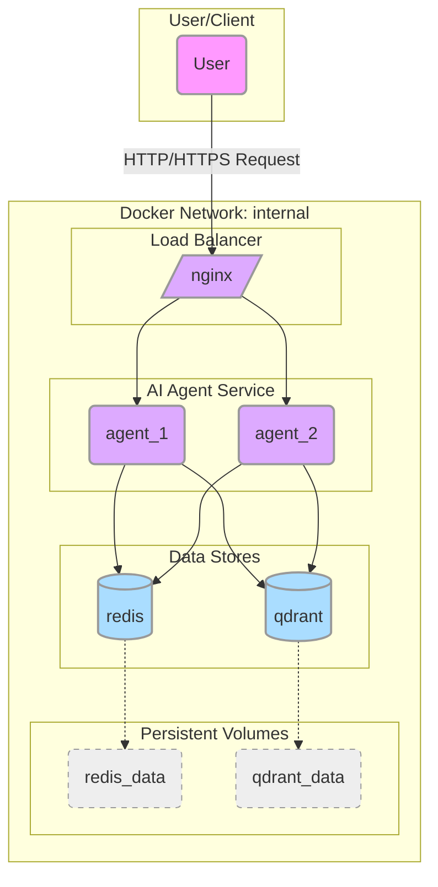

### Sơ đồ kiến trúc

### Giải thích các thành phần

1.  **User/Client:** Người dùng cuối hoặc một hệ thống khác gửi yêu cầu đến ứng dụng của bạn.

2.  **Nginx (`nginx`):**
    *   **Vai trò:** Reverse Proxy và Load Balancer.
    *   **Luồng hoạt động:** Đây là cổng vào duy nhất của hệ thống. Mọi yêu cầu từ người dùng (trên cổng 80/443) sẽ đi qua Nginx trước tiên. Sau đó, Nginx sẽ phân phối (load balance) các yêu cầu này đến các container `agent` đang chạy.
    *   **Cấu hình:** Nó sử dụng tệp `nginx.conf` từ máy của bạn để biết cách chuyển tiếp yêu cầu.

3.  **AI Agent (`agent`):**
    *   **Vai trò:** Đây là dịch vụ chính của ứng dụng, chứa logic xử lý AI (FastAPI AI agent). Tệp compose không chỉ định số lượng bản sao, nhưng kiến trúc với Nginx cho thấy nó được thiết kế để chạy nhiều bản sao (trong sơ đồ vẽ 2 bản sao là `agent_1`, `agent_2`) nhằm tăng khả năng chịu tải và tính sẵn sàng cao.
    *   **Luồng hoạt động:** Nhận yêu cầu từ Nginx, xử lý logic, và giao tiếp với các dịch vụ lưu trữ dữ liệu.
    *   **Phụ thuộc:** Nó chỉ khởi động sau khi `redis` và `qdrant` đã ở trạng thái "khỏe mạnh" (`service_healthy`).

4.  **Redis (`redis`):**
    *   **Vai trò:** Cơ sở dữ liệu key-value trong bộ nhớ, được dùng làm cache cho session và kiểm soát tần suất yêu cầu (rate limiting).
    *   **Lưu trữ:** Dữ liệu của Redis được lưu trữ bền bỉ trong một volume tên là `redis_data`. Điều này đảm bảo bạn không mất dữ liệu cache khi container được khởi động lại.

5.  **Qdrant (`qdrant`):**
    *   **Vai trò:** Cơ sở dữ liệu vector (Vector Database). Nó được sử dụng cho các tác vụ RAG (Retrieval-Augmented Generation), giúp agent tìm kiếm và truy xuất thông tin liên quan từ một kho dữ liệu lớn.
    *   **Lưu trữ:** Dữ liệu vector được lưu trữ bền bỉ trong volume `qdrant_data`.

6.  **Mạng nội bộ (`internal`):**
    *   Tất cả các dịch vụ trên đều được kết nối với nhau qua một mạng ảo riêng tên là `internal`.
    *   Điều này giúp cô lập hệ thống, tăng cường bảo mật. Chỉ có Nginx mở cổng ra bên ngoài, các dịch vụ còn lại (agent, redis, qdrant) không thể được truy cập trực tiếp từ bên ngoài Docker.

7.  **Volumes (`redis_data`, `qdrant_data`):**
    *   Đây là các "ổ đĩa" ảo mà Docker quản lý, giúp dữ liệu của Redis và Qdrant không bị mất đi khi các container bị xóa hoặc tạo lại.
